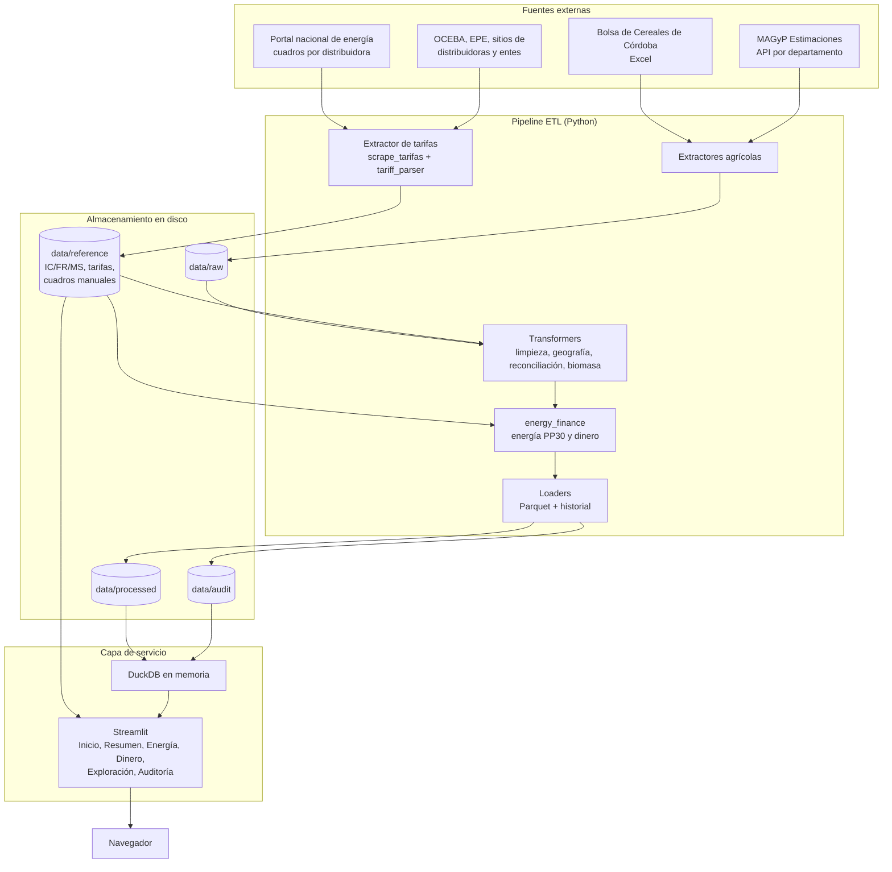

# Arquitectura

```mermaid
graph TB
    subgraph Fuentes["Fuentes externas"]
        S1[Bolsa de Cereales de Córdoba<br/>Excel]
        S2[MAGyP Estimaciones<br/>API por departamento]
        S3[Portal nacional de energía<br/>cuadros por distribuidora]
        S4[OCEBA, EPE, sitios de<br/>distribuidoras y entes]
    end

    subgraph ETL["Pipeline ETL (Python)"]
        E1[Extractores agrícolas]
        E2[Extractor de tarifas<br/>scrape_tarifas + tariff_parser]
        T1[Transformers<br/>limpieza, geografía, reconciliación, biomasa]
        T2[energy_finance<br/>energía PP30 y dinero]
        L1[Loaders<br/>Parquet + historial]
    end

    subgraph Datos["Almacenamiento en disco"]
        R1[(data/raw)]
        R2[(data/reference<br/>IC/FR/MS, tarifas,<br/>cuadros manuales)]
        R3[(data/processed)]
        R4[(data/audit)]
    end

    subgraph Servicio["Capa de servicio"]
        D1[DuckDB en memoria]
        D2[Streamlit<br/>Inicio, Resumen, Energía, Dinero,<br/>Exploración, Auditoría]
    end

    S1 --> E1
    S2 --> E1
    S3 --> E2
    S4 --> E2
    E1 --> R1
    E2 --> R2
    R1 --> T1
    R2 --> T1
    T1 --> T2
    R2 --> T2
    T2 --> L1
    L1 --> R3
    L1 --> R4
    R3 --> D1
    R4 --> D1
    R2 --> D2
    D1 --> D2
    D2 --> U[Navegador]
```
