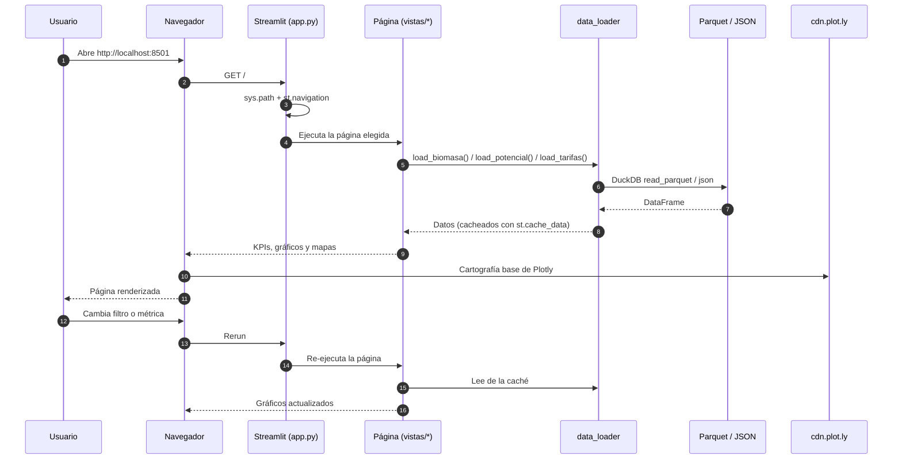

# Secuencia: carga del dashboard

```mermaid
sequenceDiagram
    autonumber
    participant U as Usuario
    participant B as Navegador
    participant S as Streamlit (app.py)
    participant P as Página (vistas/*)
    participant L as data_loader
    participant F as Parquet / JSON
    participant CDN as cdn.plot.ly

    U->>B: Abre http://localhost:8501
    B->>S: GET /
    S->>S: sys.path + st.navigation
    S->>P: Ejecuta la página elegida
    P->>L: load_biomasa() / load_potencial() / load_tarifas()
    L->>F: DuckDB read_parquet / json
    F-->>L: DataFrame
    L-->>P: Datos (cacheados con st.cache_data)
    P-->>B: KPIs, gráficos y mapas
    B->>CDN: Cartografía base de Plotly
    B-->>U: Página renderizada

    U->>B: Cambia filtro o métrica
    B->>S: Rerun
    S->>P: Re-ejecuta la página
    P->>L: Lee de la caché
    P-->>B: Gráficos actualizados
```
