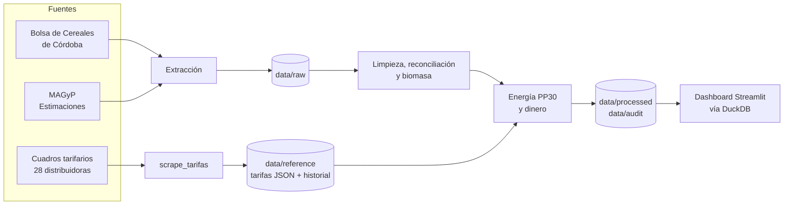

# Proceso ETL (vista general)

```mermaid
flowchart LR
    subgraph Fuentes
        CBA[Bolsa de Cereales<br/>de Córdoba]
        MAGYP[MAGyP<br/>Estimaciones]
        TAR[Cuadros tarifarios<br/>28 distribuidoras]
    end

    CBA --> EX[Extracción]
    MAGYP --> EX
    TAR --> ST[scrape_tarifas]

    EX --> RAW[(data/raw)]
    ST --> REF[(data/reference<br/>tarifas JSON + historial)]

    RAW --> TR[Limpieza, reconciliación<br/>y biomasa]
    TR --> EN[Energía PP30<br/>y dinero]
    REF --> EN
    EN --> OUT[(data/processed<br/>data/audit)]
    OUT --> DB[Dashboard Streamlit<br/>vía DuckDB]
```

Detalle de cada etapa en [`flujo_datos_detallados.md`](flujo_datos_detallados.md).
