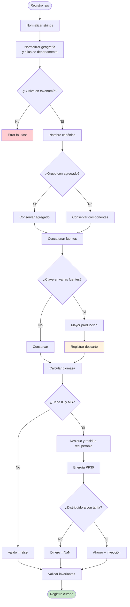

# Flujo de un registro

```mermaid
flowchart TD
    Start([Registro raw]) --> Clean[Normalizar strings]
    Clean --> Geo[Normalizar geografía<br/>y alias de departamento]
    Geo --> TaxCheck{¿Cultivo en taxonomía?}
    TaxCheck -->|No| Fail[Error fail-fast]
    TaxCheck -->|Sí| Canon[Nombre canónico]
    Canon --> AggCheck{¿Grupo con agregado?}
    AggCheck -->|Sí| KeepAgg[Conservar agregado]
    AggCheck -->|No| KeepComp[Conservar componentes]
    KeepAgg --> Concat[Concatenar fuentes]
    KeepComp --> Concat
    Concat --> Reconcile{¿Clave en varias fuentes?}
    Reconcile -->|No| KeepSingle[Conservar]
    Reconcile -->|Sí| MaxProd[Mayor producción]
    MaxProd --> Audit[Registrar descarte]
    KeepSingle --> Biomass[Calcular biomasa]
    Audit --> Biomass
    Biomass --> HasIC{¿Tiene IC y MS?}
    HasIC -->|No| FlagFalse[valido = false]
    HasIC -->|Sí| Compute[Residuo y residuo recuperable]
    Compute --> Energy[Energía PP30]
    Energy --> Tariff{¿Distribuidora con tarifa?}
    Tariff -->|No| NoMoney[Dinero = NaN]
    Tariff -->|Sí| Money[Ahorro + inyección]
    FlagFalse --> Valid[Validar invariantes]
    NoMoney --> Valid
    Money --> Valid
    Valid --> End([Registro curado])

    style Fail fill:#ffcdd2
    style End fill:#c8e6c9
    style Audit fill:#fff3e0
```
